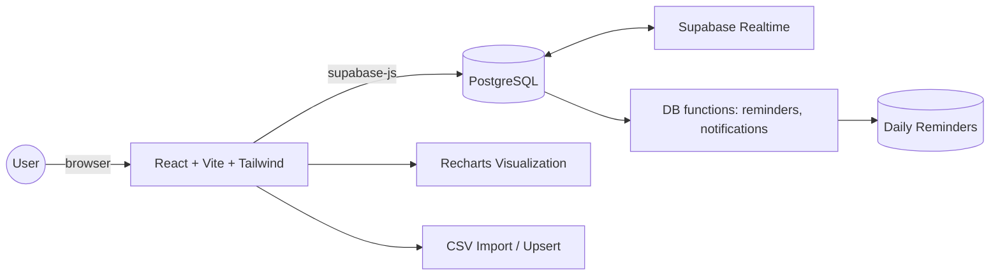
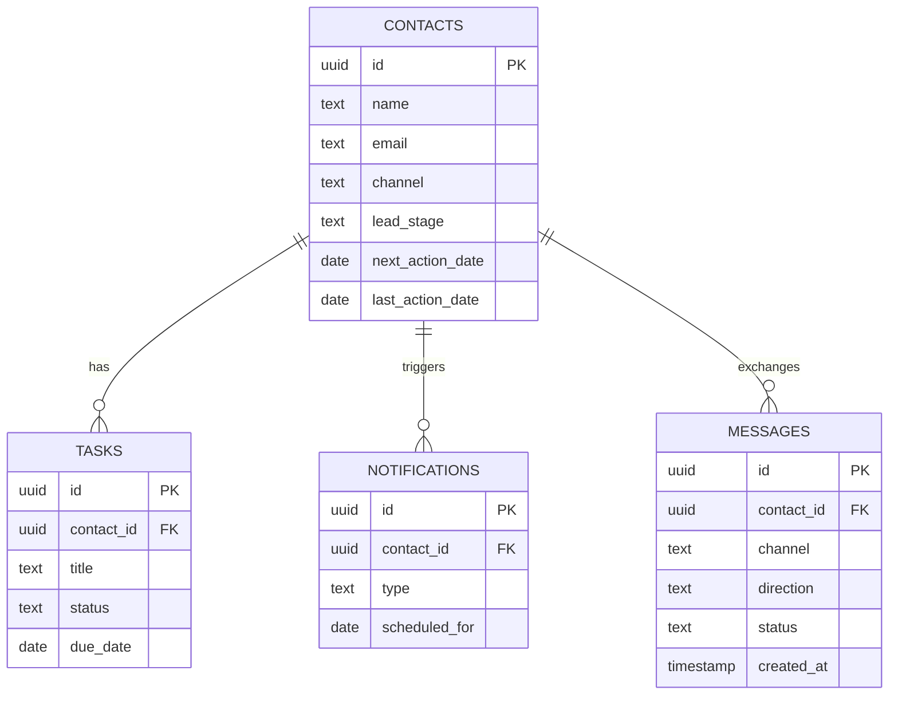

# Unified Outreach Orchestration  

## Overview  
OutreachCRM (formerly "Unified Outreach Orchestration") is a streamlined CRM that centralizes outreach management across contacts, tasks, messaging, and analytics. It provides real-time insights, a Google Sheets–like master table, and automated follow-ups powered by Supabase functions and subscriptions.  

## Key Features  
- **Master Table (Google Sheets–like)**  
  Search, sort, filter, and inline-edit contacts and outreach fields. Upsert CSVs into a normalized master table of unique contacts.  
  
- **Lead Stages & Pipeline**  
  End-to-end pipeline tracking with consistent lead stages across Contacts, Tasks, Messaging, and Scheduling pages.  
  
- **Automated Follow-ups**  
  Daily reminders generated from PostgreSQL functions using `next_action_date`. Includes due today/tomorrow buckets and notifications.  
  
- **Messaging & Tasks**  
  Create, schedule, and track outreach tasks and messages with status updates and logs.  
  
- **Analytics Dashboard (Real-time)**  
  Professional vertical bar chart showing lead stage distribution with labeled axes, grid lines, and theme-aligned colors. Updates live via Supabase Realtime.  
  
- **Help & Guides**  
  Comprehensive FAQs and usage guides with expandable sections. Video tutorials were intentionally removed per requirements.  

## Tech Stack  
- **Frontend:** React 18, TypeScript, Vite, Tailwind CSS, shadcn-ui (Radix UI + class-variance-authority), Lucide icons  
- **State/Data:** @tanstack/react-query  
- **Charts:** Recharts  
- **Backend & DB:** Supabase (PostgreSQL, SQL functions, Realtime)  
- **Build/Dev:** Vite  

## App Structure  
Key directories and files:  
- `src/pages/` — top-level route pages (e.g., `Dashboard.tsx`, `Contacts.tsx`, `Tasks.tsx`, `Messaging.tsx`, `Scheduling.tsx`, `Analytics.tsx`, `Help.tsx`, `Settings.tsx`, `MasterTable.tsx`)  
- `src/components/` — reusable UI and feature components (e.g., `ui/analytics.tsx` for the chart)  
- `src/index.css` — Tailwind and global CSS variables defining the dark green theme  
- `src/integrations/` — client integrations (e.g., Supabase client helpers)  
- `supabase/migrations/` — database schema, functions, triggers, and fixes  
- `supabase/config.toml` — Supabase project config (`project_id`)  
  
Routing is configured in `src/App.tsx` and bootstrapped in `src/main.tsx`.  
  
## Data Model & Workflows  
- **Master Contacts Table**  
  Primary source of truth consolidating imported contacts and outreach metadata.  
  
- **Key Columns**  
  - `lead_stage` — enum tracking pipeline state  
  - `next_action_date` — used by reminders/notifications (note: previous references to `next_action` were corrected in migrations)  
  - `last_action_date`, `channel`, and related outreach fields  
  
- **Automated Notifications/Reminders**  
  - Functions like `generate_daily_reminders()` and `check_and_create_notifications()` create reminders based on `next_action_date`.  
  - Migration fixed function references from `next_action` → `next_action_date` to ensure correct reminder generation.  
  
- **Realtime Updates**  
  - Supabase Realtime subscriptions push live updates to dashboards and the master table UI.  
  
- **Analytics Pipeline**  
  - Lead stage distribution derived from the master table and rendered with a vertical bar chart (axes + grid lines), aligned to theme colors and dark mode.  
  
## Environment Variables  
Create `.env.local` (or export in your shell) with:  
```bash
VITE_SUPABASE_URL=your_supabase_project_url
VITE_SUPABASE_ANON_KEY=your_supabase_anon_key
```
Do not expose service role keys in the frontend.  
  
## Local Development  
Prerequisites: Node 18+, npm (or pnpm), and optional Supabase CLI for local DB.  
  
Install and run:  
```bash
npm install
npm run dev
```
Vite dev server will start; check console for the local URL.  
  
## Database & Migrations (Supabase)  
There is a linked Supabase project in `supabase/config.toml`. To apply migrations:  
```bash
# If using Supabase locally
supabase start              # starts local services
supabase migration up       # applies all migrations

# Or push schema to remote (ensure you're linked and authenticated)
supabase db push
```
Notable migrations include a fix ensuring all functions reference `next_action_date` for notifications.  
  
## Scripts  
Defined in `package.json`:  
- `dev` — start Vite dev server  
- `build` — production build  
- `build:dev` — development-mode build  
- `lint` — run ESLint  
- `preview` — preview the production build  
  
## Theming & UI  
- Tailwind configured in `src/index.css` with CSS variables for the dark green palette.  
- shadcn-ui components powered by Radix primitives; variants via `class-variance-authority`.  
- Icons from `lucide-react`.  
  
## Pages Overview  
- `Dashboard` — high-level KPIs and quick actions  
- `Contacts` — import, manage, and edit contacts; CSV upsert  
- `Tasks` — due today/tomorrow, follow-ups, status updates  
- `Messaging` — plan and log outreach  
- `Scheduling` — manage scheduled actions  
- `Analytics` — real-time lead stage distribution chart  
- `Help` — FAQs and guides (no embedded videos by design)  
- `Settings` — preferences and account controls  
  
## Development Notes  
- Use React Query for server-state caching and mutations.  
- Keep `lead_stage` values consistent across pages.  
- Prefer typed APIs and zod schemas where applicable.  
- Ensure Supabase Row Level Security (RLS) policies are correct for any new tables.  
  
## Roadmap Ideas  
- Export analytics data (CSV/JSON)  
- Bulk task operations and templates  
- Extended channel integrations  
  
## Architecture (Mermaid)  
A high-level view of how the app pieces connect:  
  

  
## Data Model (Mermaid ER)  
A minimal entity-relationship view for core tables and relationships:  
  

  
## Author  
Madhav S Baidya